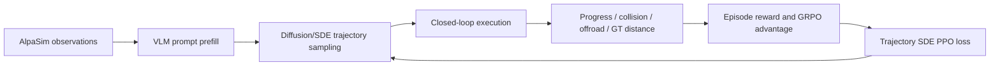

# CoT–Trajectory Alignment in Alpamayo 1.5 Closed-Loop RL

## Executive summary

The current AlpaGym reinforcement-learning path optimizes the continuous
diffusion/flow trajectory policy. It does not currently train Chain-of-Thought
(CoT), constrain CoT–trajectory consistency, or verify that the trajectory
decoder causally uses generated reasoning.

In the shipped configuration:

- autoregressive CoT generation is skipped;
- the VLM is not co-trained and gradients from the VLM are stopped;
- CoT replay is explicitly rejected by the trainer bridge;
- rewards use closed-loop driving outcomes, not reasoning quality;
- one episode-level advantage is copied to every valid policy tick.

The recommended direction is joint reasoning–action optimization with three
layers of supervision:

1. grounded, structured reasoning–trajectory consistency;
2. separate credit assignment for CoT tokens and continuous trajectories;
3. counterfactual interventions that test whether changing CoT changes the
   trajectory in the expected direction.

## 1. Current RL process

For every closed-loop policy tick, AlpaGym receives four-camera observations,
ego history, and route information from AlpaSim. The VLM performs prompt
prefill, after which the diffusion expert samples a continuous future
trajectory. AlpaSim executes the selected trajectory and returns the next
closed-loop state.

At the end of an episode, the `progress_safety` reward is:

```text
R = progress - 10 * collision_any - 5 * offroad - 0.01 * distance_to_gt
```

Cosmos-RL computes a group-relative advantage across rollouts. The trainer then
replays the recorded SDE path, recomputes its trajectory-level log probability,
and applies a clipped PPO/GRPO surrogate objective.



## 2. Why CoT is not part of the current training loop

### 2.1 CoT generation is skipped by default

`AlpamayoR1InferenceModel` defaults to `last_component="traj_future"`. This
sets `with_vlm_rollout=False`, skipping autoregressive VLM generation and going
directly from prompt prefill to trajectory diffusion.

The pretrained VLM representation may still provide useful latent features,
but there is no explicit reasoning trace that can be inspected, rewarded, or
optimized.

### 2.2 VLM parameters are not trained

Checkpoint conversion currently writes:

```python
cotrain_vlm = False
stop_grad_from_vlm = True
```

Closed-loop rewards therefore primarily update the action/diffusion expert and
cannot improve CoT generation.

### 2.3 CoT replay is deliberately unsupported

The rollout structures reserve optional `cot` and `vlm_generated_ids` fields,
but the trainer bridge raises `NotImplementedError` when generated VLM ids are
present. The missing pieces are:

- trainer tokenization in CoT mode;
- padding and attention masks for variable-length generated ids;
- rollout-time old log probabilities for CoT tokens;
- CoT token masks and current-policy token log probabilities;
- joint text/action replay semantics.

The raw `cot` field may be persisted in a replay payload, but it is not consumed
by the current trainer model input builder.

### 2.4 Reward does not inspect reasoning

The Cosmos reward callback returns only `episode_output.reward.total`. No term
currently measures:

- factual grounding against the observed scene;
- traffic-light, lane, vehicle, cyclist, or pedestrian correctness;
- agreement between stated intent and acceleration/steering behavior;
- contradictions between reasoning and trajectory;
- whether CoT causally changes planning.

### 2.5 Credit assignment is coarse

Cosmos supplies one advantage per rollout. AlpaGym copies that value to every
valid policy tick in the episode. A correct decision at one critical junction
therefore rewards unrelated ticks, while one collision penalizes every earlier
decision equally.

## 3. Grounded structured CoT–trajectory consistency

Free-form language is difficult to verify and easy to reward-hack. CoT should
include a compact structured plan alongside the explanation, for example:

```text
<risk>pedestrian_crossing</risk>
<longitudinal>decelerate</longitudinal>
<lateral>keep_lane</lateral>
<target>pedestrian_17</target>
<reason>pedestrian may enter the ego lane</reason>
```

The generated trajectory can be converted into measurable behavior:

- speed, acceleration, deceleration, and jerk;
- lateral displacement and lane transition;
- curvature and accumulated yaw;
- stopping/yielding behavior;
- time-to-collision and clearance to the stated target;
- route and lane-boundary deviation.

A consistency reward can then be defined as:

```text
R_align = R_longitudinal
        + R_lateral
        + R_yield
        + R_target
        - R_contradiction
```

Examples:

- reasoning says `brake`, but the trajectory accelerates: strong penalty;
- reasoning says `turn_left`, but lateral/yaw behavior turns right: strong
  penalty;
- reasoning claims a pedestrian hazard absent from the scene: grounding
  penalty;
- reasoning states no actionable intent: no high alignment score merely for
  remaining silent.

Rule- and geometry-based checks should be the primary verifier. An LLM judge
may be used as a secondary diagnostic, but relying on it alone rewards fluent
post-hoc explanations rather than causal driving decisions.

## 4. Separate credit assignment for reasoning and action

The total reward should retain its components instead of immediately reducing
to one scalar:

```text
R = w_env    * R_env
  + w_ground * R_grounding
  + w_align  * R_alignment
  + w_traj   * R_trajectory
```

Advantages should then be routed to the outputs they supervise:

```text
A_CoT  = A_grounding + lambda * A_alignment
A_traj = A_env + A_trajectory + lambda * A_alignment
```

The joint objective becomes:

```text
L = L_GRPO_CoT(A_CoT)
  + alpha * L_PPO_flow(A_traj)
  + beta  * KL(policy || reference)
  + gamma * L_SFT_anchor
```

This gives CoT tokens responsibility for grounded facts, explicit intent, and
reasoning–action agreement. The diffusion expert remains responsible for
closed-loop safety, progress, comfort, and executing the stated intent. The
alignment advantage couples both branches.

For temporal credit assignment, episode rewards should also be decomposed into
step- or segment-level signals. Collision precursors, TTC deterioration,
off-road onset, route progress, and plan changes can assign credit to the ticks
that actually caused the outcome.

## 5. Counterfactual causal consistency

Text–trajectory correlation does not prove that the action decoder uses CoT.
The model may generate a plausible explanation after making its decision.

For the same image and ego-history input, intervene on reasoning:

```text
CoT A: decelerate and yield
CoT B: continue accelerating
CoT C: reasoning removed or masked
```

Generate trajectories `tau_A`, `tau_B`, and `tau_C`, then verify directional
effects:

- replacing `decelerate` with `accelerate` changes the speed profile in the
  corresponding direction;
- replacing `left` with `right` changes lateral/yaw behavior accordingly;
- masking a safety-critical fact changes the relevant planning response;
- paraphrasing irrelevant wording does not materially change the trajectory.

A causal reward can combine the expected intervention effect with an
invariance penalty:

```text
R_causal = directional_effect(tau_A, tau_B)
         - irrelevant_text_sensitivity
```

This intervention test is the strongest evidence that CoT guides planning
rather than merely narrating it.

## 6. Recommended implementation sequence

### Phase 1: enable CoT-conditioned trajectory replay while freezing the VLM

1. Expose `last_component` through the policy configuration.
2. Generate one CoT and one trajectory per rollout session.
3. Persist selected `vlm_generated_ids`, decoded CoT, token lengths, and masks.
4. Pad variable-length ids in trainer collation.
5. Rebuild trainer tokenization with `last_component="cot"`.
6. Replay the same CoT while recomputing the trajectory SDE log probability.
7. Train the action expert using `R_env + R_alignment`.

This phase answers the first causal question: can the trajectory decoder use a
fixed generated CoT reliably?

### Phase 2: train CoT with VLM adapters

Full 10B VLM training is unnecessarily expensive for the first experiment.
Prefer LoRA/adapters on the VLM while continuing to train the action expert.

Required changes:

- set `stop_grad_from_vlm=False` for selected trainable adapters;
- record rollout-time per-token CoT log probabilities;
- create CoT, trajectory, format, and padding token masks;
- implement token-level GRPO with routed component advantages;
- retain reference KL and a small high-quality grounded-CoT SFT anchor.

For an 8x H200 host, joint VLM/action training may benefit from changing the
GPU split to two FSDP trainer GPUs, two rollout GPUs, and four AlpaSim GPUs.

### Phase 3: add sampled counterfactual interventions

Counterfactual rollouts need not run on every sample. Applying interventions to
approximately 10–20% of suitable scenes is enough to measure and optimize CoT
utilization while controlling simulator cost.

## 7. Diagnostics

Track at least:

- `cot_grounded_fact_precision`;
- `cot_grounded_fact_recall`;
- `cot_contradiction_rate`;
- `cot_action_alignment`;
- `cot_active_intent_rate`;
- `trajectory_delta_under_cot_intervention`;
- `irrelevant_cot_sensitivity`;
- `cot_utilization_score`;
- per-risk collision, off-road, progress, TTC, comfort, ADE, and FDE;
- separate `A_CoT`, `A_traj`, and `A_alignment` distributions.

Long CoT should not receive a reward by itself. Generic or silent CoT must not
receive a high consistency score merely because it avoids making falsifiable
claims.

## 8. Required ablations

1. Current baseline: no generated CoT, trajectory PPO only.
2. Generate CoT, but do not reward or train it.
3. Grounded CoT reward only.
4. CoT–trajectory alignment reward.
5. Alignment plus token/flow advantage routing.
6. Full routing plus counterfactual causal reward.

If groups 1 and 2 produce essentially identical trajectories, the decoder is
ignoring generated CoT. A convincing result requires both improved closed-loop
safety/tail-risk metrics and predictable trajectory changes under controlled
CoT interventions.

## 9. Existing reusable work

The previous Alpamayo 1.5 development tree contains useful prototypes for:

- CoT parsing and grounded fact checks;
- Reasoning–Action Alignment (RAA);
- contradiction penalties;
- component reward logging;
- token-level advantage routing.

The reward concepts can be migrated, but the old trainer and packer should not
be copied directly: they target text/discrete-trajectory token replay, whereas
current AlpaGym uses selected continuous SDE trajectory replay. The migration
must preserve the new replay trace, old/new trajectory log-probability, and
closed-loop episode transport contracts.
