# AlpaGym Runtime

The runtime package contains the Cosmos-RL rollout backend and the AlpaSim
gRPC boundary used to run simulator-backed episodes.

## Table of Contents

- [Overview](#overview)
- [Vocabulary](#vocabulary)
- [Per-Tick Rollout Layers](#per-tick-rollout-layers)
- [Cross-Cutting Layers](#cross-cutting-layers)
- [Rollout Dataflow](#rollout-dataflow)
- [AlpaSim Connection Lifecycle](#alpasim-connection-lifecycle)
- [Rollout Transport and Replay](#rollout-transport-and-replay)
- [Threading Model](#threading-model)
- [Key Contracts](#key-contracts)

## Overview

The runtime lets Cosmos-RL train on AlpaSim episodes. Cosmos asks
`AlpagymRollout` for a batch of payloads, the rollout worker dispatches one
`simulate(1)` call per requested rollout to AlpaSim, AlpaSim calls back into
the worker's `EgodriverService` for driving decisions, and the worker
transfers completed episodes back to Cosmos for training.

The dispatcher is **streaming**: up to `max_concurrent_rollouts` simulate
calls run in parallel; each rollout owns its own `session_uuid`; failed
rollouts retry per-payload until a per-payload budget is exhausted. The
rollout worker also accepts cosmos-rl's `enqueue_prefetch_payloads` hook so
the next batch's simulate calls can start before the current batch's
`rollout_generation` returns.

Each AlpaSim session owns one `Policy` instance. A policy accumulates
observations across drive ticks, builds the model input, submits it for
inference, selects one trajectory, and returns a `PolicyOutput`: the
ego-frame trajectory returned to AlpaSim's `drive` call. Policies on the
same rollout worker share one `InferenceEngine` running on a long-lived
thread, which batches model forwards across overlapping rollouts.

The transport layer is the handoff from completed simulator sessions to the
Cosmos-RL worker. Disk transport writes local JSON artifacts for development
and single-process validation. NCCL transport is the distributed Cosmos-RL path:
rollout workers return `nccl:` handles, TCPStore carries manifests and
rendezvous state, and NCCL carries tensor payloads to policy workers.

The runtime has two complementary views of its layers:

- The **per-tick rollout layers** describe what happens on every drive tick
  (simulator → policy → inference engine → inference model → released model).
- The **cross-cutting layers** describe what spans the rollout worker's
  end-to-end orchestration: Cosmos-RL adapter, episode runner, reward, and
  transfer.

Both are documented below.

## Vocabulary

The runtime distinguishes three nouns that all sound like "one piece of work":

- **rollout** — Cosmos-RL's term for one prompt-completion pair
  (`RolloutResult`, `rollout_generation`, "rollout worker", "rollout backend").
  Each rollout maps to one `simulate(1)` call dispatched by the streaming
  worker; internally it is tracked as a `_RolloutJob`.
- **episode** — our-side per-session payload (one scene × one generation),
  represented by `EpisodeOutput`, recorded on `_Session`/`SessionRecord`, and
  written out as a `RolloutArtifact`. One episode == one rollout == one
  `simulate(1)` call.
- **payload** — one `RLPayload` from Cosmos-RL, tracked inside the worker
  as a `SharedPayloadState` ("shared" because the same state object is
  shared across the payload's `rollouts_per_payload` sibling rollouts and
  resolved with a list of `EpisodeOutput`s once all siblings land).
- **batch** — Cosmos-RL's batch of payloads handed to one
  `rollout_generation` call (size `cosmos.rollout.batch_size`). Batch is
  a Cosmos-side noun only: `AlpagymRollout` fans each batch out to
  per-payload `submit_payload` calls, awaits each payload's future in
  input order, and reassembles results. The streaming worker itself has
  no batch concept.

And two model wrappers that sit on either side of the policy/rollout split:

- **inference model** — alpagym-side wrapper that adapts `BatchedModelInput`
  to one released model's `data` dict. The public release ships the
  `AlpamayoR1` implementation under `packages/policies/alpamayo_r1/`; other
  model bundles can be provided by installed policy plugins.
- **released model** — the external trajectory model
  (`alpamayo_r1_release.*`, ...).
- **training wrapper** / **Cosmos policy wrapper** — the *other half* of the
  pair, living in the released-model repos
  (for example, `BaseCosmosWrapper` in
  `packages/policies/alpamayo_r1/`).
  Subclasses
  `cosmos_rl.policy.model.base.BaseModel`. Owns weight-sync, FSDP/TP, the
  Cosmos `ModelRegistry`. Not part of alpagym; named here because it is what
  motivates the inference-side wrapper's "Inference" prefix.

## Per-Tick Rollout Layers

The rollout decision path has five runtime layers with no overlapping
ownership: **simulator**, **policy**, **inference engine**, **inference
model**, and the external **released model**.

The diagram names `AlpamayoPolicy` because that is the concrete policy path
implemented today. The policy supports Alpamayo-family trajectory models that
expose `sample_trajectories_from_data(...)`: the `policy.model.kind` knob on
the policy config selects which installed `InferenceModel` bundle the loader
builds. The public release supports `alpamayo_r1`; additional model families
plug in by adding an `InferenceModel` implementation under
`packages/policies/<bundle>/src/alpagym_<bundle>/inference_model.py` and
registering it as an `alpagym.policy_bundles` entry point.

The policy stacks `policy.model.num_context_frames` frames per camera in
cam-major order (each camera contributes its last `num_context_frames`
ring entries, oldest -> newest), so the leading axis of
`BatchedModelInput.camera_frames` is `T = N_cam * num_context_frames`. The
Alpamayo R1 inference model reshapes that flat axis into
`(N_cam, num_context_frames, ...)` inside `build_alpamayo_r1_forward_inputs`
before handing the dict off to the released model.

```mermaid
flowchart LR
    AlpaSim["AlpaSim simulator"]

    subgraph simulator["Simulator layer"]
        direction TB
        Servicer["EgodriverService"]
        TickBuffer["TickBuffer"]
        ProtoConversion["proto_conversion.py"]
    end

    subgraph policy["Policy layer"]
        direction TB
        Policy["AlpamayoPolicy"]
        Buffers["ObservationBuffers"]
        ModelInput["ModelInput"]
        Selector["TrajectorySelector"]
    end

    subgraph engine["Inference engine layer"]
        direction TB
        Engine["InferenceEngine"]
    end

    subgraph infmodel["Inference model layer"]
        direction TB
        InferenceModelNode["InferenceModel (alpagym-owned)"]
    end

    Model["released model (external)"]

    AlpaSim <-->|gRPC| Servicer
    Servicer --> TickBuffer
    TickBuffer --> ProtoConversion
    ProtoConversion -->|PolicyInput| Policy
    Policy --> Buffers
    Buffers --> ModelInput
    ModelInput -->|ModelInput| Engine
    Engine -->|ModelOutput| Selector
    Selector -->|chosen trajectory| Policy
    Engine -->|BatchedModelInput| InferenceModelNode
    InferenceModelNode -->|dict| Model
    Model -->|raw tuple| InferenceModelNode
    InferenceModelNode -->|BatchedModelOutput| Engine
    Policy -->|PolicyOutput| ProtoConversion
    ProtoConversion -->|DriveResponse| Servicer
```



Layer responsibilities:

- **Simulator layer** (`alpasim/`) speaks the AlpaSim gRPC protocol, starts and
  closes sessions, snapshots tick-local proto buffers into typed `PolicyInput`,
  calls the session `Policy`, and packs `PolicyOutput` into `DriveResponse`. It
  does not decode images, assemble model inputs, choose trajectories, or write
  artifacts.
- **Policy layer** (`policies/`) owns model-family-shared state and cross-tick
  state for one session. `AlpamayoPolicy.step` runs `_preprocess` →
  `inference_engine.infer` → `_postprocess`: the preprocess stage packs camera
  frames, ego history, and route into a typed `ModelInput`; the inference
  engine returns one `ModelOutput`; the postprocess stage runs the
  selector and packs the `PolicyOutput`.
- **Inference engine layer** (`inference/`) owns the batched path to the live
  model during rollout. It is model-family-agnostic: it consumes `ModelInput`
  / `ModelOutput`, stacks inputs field-wise into `BatchedModelInput`, and
  dispatches one
  `inference_model.sample_trajectories_from_data(batched, sampling, return_trace_for_rl)`
  call per drained batch, then `BatchedModelOutput.unbind()`s the result so
  each caller's future resolves with its own `ModelOutput`. `run_loop()`
  runs on a long-lived daemon thread (`alpagym-infer`) spawned by
  `AlpagymRollout.init_engine`; the thread serves inference for all
  concurrent rollouts across the worker's lifetime. A forward-pass exception
  is fatal — `run_loop` logs the traceback and calls `os._exit(1)`, after
  which cosmos-rl's controller detects the dead replica through heartbeat
  timeout and triggers mesh rebuild on survivors.
- **Inference model layer** (per-bundle packages, such as
  `packages/policies/alpamayo_r1/...`) is the
  alpagym-owned, per-released-model rollout wrapper. It is the single place
  where the released-model dialect is translated: packing `BatchedModelInput`
  into the bundle's `data` dict, picking the right method
  (`sample_trajectories_from_data` vs `…_with_vlm_rollout`), and normalizing
  the variable-length raw tuple into a unified `BatchedModelOutput` (always 4
  fields: `pred_xyz`, `pred_rot`, optional `logprob`, `extra`). The "Inference" prefix
  is intentional: each released model also has a **training-side** Cosmos
  wrapper (see [Vocabulary](#vocabulary)) on the
  policy worker; the two wrappers are mirror images of each other.
- **Released model** (external) — the actual trajectory model
  (`alpamayo_r1_release` / `alpamayo_1.5_release`). Lives outside alpagym;
  alpagym only knows it through the inference model wrapper.

The import direction is intentionally simple: `inference/types.py` defines
the shared `ModelInput` / `BatchedModelInput` / `ModelOutput` /
`BatchedModelOutput` / `InferenceModel` contract,
`inference/` is model-family-agnostic, `policies/alpamayo/` owns policy
state, and each bundle ships its inference model wrapper under
its per-bundle package (`packages/policies/alpamayo_r1/...`),
`policies/factory.py` owns family + `model.kind` dispatch (it imports the
family packages and the inference engine), `alpasim/` owns the gRPC
boundary and per-session recording on `_Session`, `episode_runner/` owns
the streaming dispatch orchestration (see
[Cross-Cutting Layers](#cross-cutting-layers)), and `cosmos/` wires the
runtime into Cosmos-RL by calling `policies/factory.py` and handing the
resulting engine + factory to `EgodriverServer` and
`StreamingRolloutWorker`.

### Model-bundle dispatch

Today there is one **policy family** (`alpamayo`), statically pinned in
`RunConfigSchema.policy: AlpamayoPolicyConfig`. `policies/factory.py` has no outer
family branch: `build_inference_engine` and `build_policy_factory` construct
the Alpamayo path directly. Adding a second family will need both a schema
change in `host.config` (e.g. making `RunConfigSchema.policy` polymorphic) and a
new outer branch in both factory functions.

Within the Alpamayo family, `policy.model.kind` selects the **released-model
bundle** (the `InferenceModel` implementation). The public release ships
`"alpamayo_r1"`. Adding a new bundle means a new `InferenceModel`
implementation under its per-bundle package
(`packages/policies/<bundle>/...`) and an `alpagym.policy_bundles` entry
point. The Cosmos-RL adapter in `cosmos/rollout_backend.py` stays
family-agnostic: it only calls `build_inference_engine(...)` and
`build_policy_factory(...)`.

## Cross-Cutting Layers

The per-tick layers above describe what happens on every drive tick. Once
zoomed out, four additional layers do the orchestration, persistence, and
Cosmos-RL integration work:

- **Cosmos-RL adapter layer** (`cosmos/`) — registers and implements all the
  plug-ins Cosmos-RL needs: `Dataset`, `DataPacker`, fake policy model +
  tokenizer + weight mapper, fake trainer, reward callback, rollout backend,
  and the `torchrun` entrypoint. Six of seven files are pure adapters; only
  `rollout_backend.py` is also a thin construction site that builds the
  inference engine + policy factory + driver server + streaming worker, and
  spawns the long-lived engine thread.
- **Episode runner layer** (`episode_runner/`) — owns the streaming dispatch
  of rollouts. `StreamingRolloutWorker` (in
  `episode_runner/streaming_worker.py`) maintains up to
  `max_concurrent_rollouts` overlapping `simulate(1)` calls; tracks a
  per-payload retry budget; resolves one `Future[list[EpisodeOutput]]`
  per cosmos-rl payload when its `rollouts_per_payload` sibling rollouts
  have landed. One public entry point: `submit_payload(payload)`,
  idempotent by `prompt_idx`. Both cosmos hooks
  (`enqueue_prefetch_payloads` and `rollout_generation`) call it; the
  live-state index (`dict[prompt_idx -> SharedPayloadState]`) is
  populated on first submit and drained when the future resolves. The
  worker is a gRPC client of AlpaSim's
  `RuntimeService` but not itself a gRPC servicer, and it crosses every
  per-tick layer, which is why it has its own top-level module.
- **Reward layer** (`rewards/`) — pure compute on
  `(EpisodeOutput, GroundTruth, RewardConfig) → RewardResult`. Called from
  the streaming worker before each artifact is written. No I/O, no model
  dependencies.
- **Transport layer** (`transport/`) — persists/reads completed `EpisodeOutput`
  payloads between the rollout side (worker process) and the trainer side
  (Cosmos `packer.py` + reward callback). Disk-backed JSON handles local
  development; NCCL handles distributed Cosmos-RL runs.

```mermaid
flowchart TB
    Cosmos["Cosmos-RL framework"]

    subgraph adapter["Cosmos-RL adapter layer (cosmos/)"]
        direction TB
        Entrypoint["entrypoint.py"]
        DatasetMod["dataset.py"]
        PackerMod["packer.py"]
        Trainer["trainer.py"]
        RewardFn["reward_fn.py"]
        Backend["rollout_backend.py: AlpagymRollout"]
    end

    subgraph orch["Episode runner layer (episode_runner/streaming_worker.py)"]
        direction TB
        Worker["StreamingRolloutWorker (idempotent submit_payload)"]
        SimPool["N worker threads pulling jobs from priority queue (retries preempt)"]
        Worker --> SimPool
    end

    subgraph perTick["Per-tick rollout layers (see Per-Tick Rollout Layers)"]
        direction TB
        Sim["simulator layer"]
        Policy["policy layer"]
        Engine["inference engine"]
        InfModel["inference model layer"]
        ReleasedModel["released model (external)"]
    end

    subgraph rew["Reward layer (rewards/)"]
        Reward["compute_reward"]
    end

    subgraph xfer["Transport layer (transport/)"]
        XferWrite["EpisodeWriter.write (disk / NCCL)"]
        XferRead["read_episode_json / NCCL receiver"]
    end

    Cosmos -->|rollout_generation| Backend
    Cosmos -->|enqueue_prefetch_payloads| Backend
    Backend -->|submit_payload| Worker
    SimPool -->|per drive tick| perTick
    SimPool -->|per completed simulate(1)| Reward
    SimPool -->|in-memory EpisodeOutput| RewardFn
    PackerMod -->|get_rollout_output egress| XferWrite
    XferRead -->|get_policy_input read back| PackerMod
```

## Rollout Dataflow

Cosmos calls `rollout_generation(...)` when it needs the next batch of
rollouts; `AlpagymRollout` fans the batch out into per-payload
`submit_payload(payload)` calls. In parallel cosmos-rl's `_prefetch_loop`
calls `enqueue_prefetch_payloads(...)` and the adapter forwards each
payload via the same `submit_payload(payload)` call so the next batch's
simulate calls start while the current batch is still in flight. On a
cache miss the worker spawns one `_RolloutJob` per (payload, generation)
pair onto its work queue for up to `max_concurrent_rollouts` worker
threads, and resolves one `Future[list[EpisodeOutput]]` per
payload once its `rollouts_per_payload` sibling rollouts have all
completed.

The inference engine runs on a separate long-lived thread spawned in
`init_engine`, so any simulate-pool worker can request inference at any
time; the engine batches whatever is in its queue up to
`max_batch_size`.

```mermaid
sequenceDiagram
    participant C as Cosmos thread
    participant W as StreamingRolloutWorker
    participant S as simulate-pool worker
    participant R as RuntimeService
    participant G as egodriver gRPC pool
    participant P as session policy
    participant E as inference engine thread
    participant IM as inference model
    participant M as released model
    participant T as transport layer

    C->>W: submit_payload(payload)
    W->>S: put _RolloutJob per (payload, generation) on priority queue (cache miss)
    S->>R: simulate(1) with pinned session_uuid
    R->>G: start_session
    G->>P: policy_factory
    R->>G: submit observations
    G->>G: update TickBuffer
    R->>G: drive
    G->>P: step PolicyInput
    P->>E: infer ModelInput
    E->>IM: BatchedModelInput
    IM->>M: data dict
    M-->>IM: raw tuple
    IM-->>E: BatchedModelOutput
    E-->>P: set ModelOutput on Future
    P-->>G: PolicyOutput
    G->>G: _Session.record_step
    G-->>R: DriveResponse
    R->>G: close_session
    G->>G: _Session.get_record -> SessionRecord
    R-->>S: simulate(1) return
    S->>G: pop_session_record(uuid)
    S->>T: compute_reward + write artifact
    S->>W: _on_rollout_succeeded (resolve future when rollouts_per_payload collected)
    W-->>C: SharedPayloadState (per payload); adapter packs into list[RolloutResult]
```

The diagram introduces the streaming orchestration components:

- `AlpagymRollout` (Cosmos-RL adapter layer) owns rollout-worker setup, local
  model loading via `policies/factory.py`, egodriver publication, the
  persistent `RuntimeServiceStub`, and the engine thread. It delegates
  per-rollout dispatch to `StreamingRolloutWorker`.
- `StreamingRolloutWorker` (episode runner layer,
  `episode_runner/streaming_worker.py`) owns the per-payload retry budget
  and the live-state index `_active_payload_states`. Dispatch goes through a
  `queue.PriorityQueue` consumed by N `alpagym-sim-{i}` worker threads;
  retried jobs use a higher priority than fresh dispatch so a retry runs
  before any payload that hasn't started yet. Each `_RolloutJob` runs
  through `_run_rollout`: build a `SimulationRequest` pinning the job's
  `session_uuid`, call the runtime stub's `simulate`, pop the driver
  server's `SessionRecord`, compute reward, write artifact,
  `_on_rollout_succeeded` (or `_on_rollout_failed` → retry).
- `RuntimeService` belongs to AlpaSim. It runs the requested scenes and calls
  the worker's egodriver service for session callbacks.
- `EgodriverService` (simulator layer) belongs to the rollout worker. It
  creates one policy per session, receives observations, calls `Policy.step`
  on each drive tick, records the I/O pair onto the per-session `_Session`,
  and on `close_session` freezes the session into a `SessionRecord` keyed by
  `session_uuid` for the streaming worker to pop.
- The transport layer sends completed episodes back to Cosmos over a
  role-directional writer/reader boundary (`transport/base.py`), with disk and
  NCCL implementations (`transport/disk.py`, `transport/nccl/`).

## AlpaSim Connection Lifecycle

AlpaGym uses two gRPC services during simulator rollouts:

- AlpaSim owns `RuntimeService`. The host process starts AlpaSim Wizard, waits
  for the service to become reachable, and publishes its endpoint.
- Each Cosmos rollout worker owns one `EgodriverService`. AlpaSim calls it to
  start sessions, submit observations, request drive ticks, and close sessions.

The file-backed `FileTopologyRegistry` is the handoff between the host process
and rollout workers. It keeps endpoint discovery explicit without making either
side manage the other's process.

The lifecycle is:

01. The host writes resolved run artifacts, starts AlpaSim Wizard, and publishes
    the Wizard `RuntimeService` endpoint.
02. `AlpagymRollout.init_engine` builds the `InferenceEngine` (spawning the
    long-lived `alpagym-infer` thread), the `EgodriverServer`, a persistent
    gRPC channel + `RuntimeServiceStub` to AlpaSim, and the
    `StreamingRolloutWorker`.
03. The worker publishes its egodriver endpoint and reads the AlpaSim runtime
    endpoint from the topology registry.
04. For each `_RolloutJob` dispatched by the streaming worker,
    `_run_rollout` sends a `SimulationRequest` describing one rollout of one
    scene, pinning the job's `session_uuid` on `RolloutSpec.session_uuids`.
05. AlpaSim opens one driver session per simulate(1) call. The driver converts
    session calibration once and invokes the configured `policy_factory` with
    `(session_uuid, calibration, random_seed)` to build the per-session policy.
06. AlpaSim submits tick observations. The driver stores them in the session's
    `TickBuffer`.
07. On `drive`, the driver snapshots the buffer into `PolicyInput`, clears
    tick-local fields, calls `Policy.step`, records the I/O pair onto the
    per-session `_Session` (`outputs` list and deduplicated `executed_poses`),
    and converts `PolicyOutput` to `DriveResponse`.
08. On `submit_recording_ground_truth`, the driver stores the per-session
    ground truth directly on `_Session.ground_truth`.
09. On `close_session`, the driver calls `_Session.get_record()` to freeze
    the per-session payload into a `SessionRecord` (`outputs`,
    `executed_ego_trajectory`, `ground_truth`) and stores it on the servicer
    keyed by `session_uuid`. The per-session ordering invariant — the AlpaSim
    runtime returns from `simulate(1)` only after our gRPC server has acked
    the matching `close_session` — guarantees the record is present when the
    simulate-pool worker pops it.
10. When `simulate(1)` returns, the simulate-pool worker pops the
    `SessionRecord` via `pop_session_record(session_uuid)`, builds an
    `EpisodeOutput`, and computes reward, stamping `EpisodeOutput.reward`.
    Once `rollouts_per_payload` siblings for one payload have completed, the
    worker resolves that payload's future with the in-memory `EpisodeOutput`s
    and `rollout_generation` returns them (in input order) to Cosmos-RL as a
    `RolloutResult`. No transport handle exists yet: the reward dispatcher
    reads `episode.reward.total` directly off the in-memory completion, and
    egress to the transport layer happens later, in
    `AlpagymDataPacker.get_rollout_output`, after reward and DAPO filtering.

`proto_conversion.py` is the only proto translation point:

- `build_simulation_request_proto` creates AlpaSim `RuntimeService` requests.
- `policy_input_from_tick_buffer` converts buffered observations into
  `PolicyInput`. Session calibration is supplied by the per-session record
  built at `start_session`.
- `drive_response_from_policy_output` converts chosen-trajectory tensors into
  `DriveResponse`, using `time_now_us + chosen_dt_us[i]` for absolute
  timestamps.

## Rollout Transport and Replay

The transport layer sends completed episodes from runtime sessions to the
Cosmos-RL worker. Its local-development implementation is `transport/disk.py`,
which writes one JSON file per completed session. That JSON payload is
produced by `_episode_to_artifact_dict` in `transport/disk.py` and contains:

- `scene_id`, `session_uuid`, `num_steps`, and `is_valid`;
- serialized `PolicyOutput`s for each recorded drive step;
- the executed ego trajectory in the simulator-stable `local` frame;
- `route_waypoints` (currently always empty, see below);
- optional simulator metrics when the runtime can assign them unambiguously;
- optional reward fields from the `EpisodeOutput` contract.

The per-session `_Session` on the egodriver servicer records each tick's
`PolicyOutput` and the executed ego pose, plus the per-session ground truth
on `submit_recording_ground_truth`. On `close_session` the servicer freezes
that state into a `SessionRecord` (via `_Session.get_record()`) and the
episode runner drains it via `pop_session_record(uuid)` to call
`compute_reward(episode, ground_truth, reward_config)` and stamp
`EpisodeOutput.reward` before writing each artifact. `route_waypoints` stays
empty because AlpaSim's `SimulationReturn` does not carry per-session route
summaries; route data still reaches the policy through tick observations.
`PolicyOutput.replay_data` is included in the transfer payload; the disk
writer recursively flattens tensor and dataclass leaves itself via
`_artifact_default`, so callers do not need to pre-flatten the dict (see
the round-trip contract below).

`cosmos/packer.py` owns this process's transport endpoint: the rollout worker
egresses each surviving `EpisodeOutput` through the writer in `get_rollout_output`
(returning an opaque handle), and the policy worker resolves those handles back
into episodes in `get_policy_input`. Disk writes local JSON artifacts (read back
with `read_episode_json`); NCCL returns `nccl:<rollout_idx>:<uuid>` handles,
stores the reconstruction manifest in TCPStore, and moves tensors over the NCCL
data plane (see `transport/nccl/README.md`). Completed episodes are handed to the
trainer with their recorded policy outputs and replay data. For trainer runs,
host validation requires `policy.inference.return_trace_for_rl=true`
(`config_validation.py`), so the rollout worker requests replay traces from
inference and `PolicyOutput.replay_data` carries the typed `ModelInput` under the
`"model_input"` key alongside selection metadata (`per_traj_logprob`,
`set_ix`, `sample_ix`) as siblings; the disk writer flattens tensor leaves to
nested lists.

The round-trip contract for `replay_data` and `model_extra` is intentionally
narrow: top-level `PolicyOutput` tensor fields (`chosen_xyz` / `chosen_quat` /
`chosen_dt_us` / `chosen_logprob` / `all_pred_*`) are written as nested lists
on the way out and rehydrated as typed `torch.Tensor` on the way back in by
`_policy_output_from_dict`. `replay_data` and `model_extra` are dispatch-by-
convention payloads: the writer flattens any tensor / dataclass leaves
recursively via `_artifact_default` so the JSON dump succeeds, but the reader
returns them unchanged as plain `dict[str, Any]` values. Trainer-side code is
responsible for rehydrating named leaves (e.g. converting
`replay_data["model_input"]` back into a `ModelInput` of tensors, or
`per_traj_logprob` back into a tensor). The disk format is the on-disk payload,
not a typed training payload, and inflating every leaf type here would force
the runtime to know the trainer's schema. The disk round-trip tests in
`transport/tests/test_disk.py` pin both halves of this contract.

## Threading Model

The swimlane below lays out the four execution contexts and the two sync
levels (outer per-rollout simulate-gRPC, inner per-tick Future). Each node
is annotated with the source file relative to
`packages/runtime/src/alpagym_runtime/`. The text bullets
that follow cross-reference the lanes shown here.

```text
rollout worker process
├── Cosmos rollout thread
│   └── AlpagymRollout.rollout_generation(payloads)              [cosmos/rollout_backend.py]
│       └── StreamingRolloutWorker.submit_payload(payload)       [episode_runner/streaming_worker.py]
│           └── dispatch up to max_concurrent_rollouts _RolloutJob items
│               on the simulate pool, then await each payload's future
│
├── simulate pool (N daemon threads = max_concurrent_rollouts)  [names alpagym-sim-{i}]
│   └── _rollout_worker_loop: pull _RolloutJob from queue.PriorityQueue (retries first), _run_rollout(rollout_job)
│       │                                            ── OUTER SYNC (gRPC, blocking) ──┐
│       │                                                                             │
│       ├── RuntimeService.simulate(one rollout, session_uuid pinned) ──────────────► │
│       │                                                                             ▼
│       │                          AlpaSim RuntimeService (separate process)
│       │                            │  for the requested (scene_id, session_uuid):
│       │                            │      start_session + tick observations + drive × K + close_session
│       │                            │
│       │                            │  per drive tick (the INNER cycle):
│       │                            │    AlpaSim ──[driver-gRPC]──► EgodriverService.drive   [alpasim/driver_server.py]
│       │                            │                               (gRPC worker thread inside rollout worker)
│       │                            │                               │
│       │                            │                               ├── proto_conversion.policy_input_from_tick_buffer
│       │                            │                               ├── AlpamayoPolicy.step  [policies/alpamayo/policy.py]
│       │                            │                               │     └── engine.infer(model_input).result()
│       │                            │                               │         ── INNER SYNC (Future, in-proc) ──┐
│       │                            │                               │            (ModelInput on SimpleQueue,    │
│       │                            │                               │             resolved by the engine thread)│
│       │                            │                               ├── _Session.record_step (single-threaded per session)
│       │                            │                               └── proto_conversion.drive_response_from_policy_output
│       │                            │
│       │                            │  on close_session:
│       │                            │      _Session.get_record → SessionRecord
│       │                            │      (stored on EgodriverGrpcServicer._session_records keyed by uuid)
│       │                            │
│       │                            ▼  simulate returns ─────► simulate-pool worker unblocks
│       │
│       ├── pop_session_record(uuid) → SessionRecord
│       ├── compute_reward(episode, ground_truth, reward_config)   [rewards/compute.py]
│       └── _on_rollout_succeeded(episode) (or _on_rollout_failed → retry)
│           └── once rollouts_per_payload siblings collected: future.set_result(episodes)
│               (egress to the transport layer happens later in packer.get_rollout_output)
│
└── alpagym-infer engine thread (one, long-lived, daemon=True)   [inference/inference_engine.py]
    └── InferenceEngine.run_loop()
        ├── blocks on first SimpleQueue entry, drains ≤ max_batch_size more entries
        ├── BatchedModelInput.stack → inference_model.sample_trajectories_from_data
        │     (per-bundle adapter: alpamayo_r1 or another installed bundle)
        │     [packages/policies/alpamayo_r1]
        ├── BatchedModelOutput.unbind() → per-future ModelOutput.set_result(...) ──► gRPC worker N unblocks
        ├── exits cleanly on shutdown sentinel (AlpagymRollout.shutdown)
        └── on any forward-pass exception: log + os._exit(1)
```

The runtime uses four execution contexts:

- The **Cosmos rollout thread** calls `rollout_generation`, hands payloads to
  the streaming worker, and blocks on the per-payload futures.
- The **simulate pool** (`max_concurrent_rollouts` daemon threads named
  `alpagym-sim-{i}`) runs one `simulate(1)` per job, then finalizes.
- The **`EgodriverServer` gRPC pool** (`2 * max_concurrent_rollouts + 2`
  worker threads) serves `start_session`, `submit_*`, `drive`, and
  `close_session` callbacks. The `2N + 2` sizing accommodates up to `N`
  drive() handlers in flight concurrently with up to `N` close_session
  callbacks plus a few non-session RPCs.
- The **`alpagym-infer` engine thread** (one daemon thread, spawned in
  `init_engine`) runs `InferenceEngine.run_loop` for the worker's lifetime.

There is one shared in-process synchronization point:

- `InferenceEngine` uses `queue.SimpleQueue` for `(ModelInput, future)`
  inference requests. The producer (simulate-pool worker → policy.step →
  engine.infer) enqueues; the engine thread dequeues, batches, and resolves
  the future.

Per-session recording on `_Session` (output list + deduplicated executed
poses) needs no lock: AlpaSim drives a given session from a single gRPC
worker at a time, so `record_step`, `submit_recording_ground_truth`, and
`get_record` are serialized per session by the protocol.

`StreamingRolloutWorker` uses one `threading.Lock` to protect
`_active_payload_states` and the per-payload `SharedPayloadState` fields.
Dispatch decisions (cache check, insert, enqueue) happen in one critical
section; cache drain happens in the same critical section that flips
`future_resolved = True`. Future resolution (`future.set_result(...)`) runs
outside the lock by the thread that flipped the flag.

A forward-pass exception in the engine thread kills the process via
`os._exit(1)` rather than attempting soft recovery; cosmos-rl's controller
detects the dead replica through heartbeat timeout and triggers mesh rebuild
on the surviving replicas.

## Key Contracts

- `PolicyInput` is one typed drive-tick snapshot. It includes tick-local camera
  images and ego trajectory, session calibration, and the latest route or
  ground truth when AlpaSim has supplied them.
- `PolicyOutput` is one selected ego-frame trajectory. `chosen_xyz`,
  `chosen_quat`, and `chosen_dt_us` are the only fields required to answer
  AlpaSim's `drive` call.
- `Policy` is the per-session interface consumed by the simulator layer:
  `step(PolicyInput) -> PolicyOutput` and `close() -> None`.
- `ModelInput` / `BatchedModelInput` / `ModelOutput` / `BatchedModelOutput`
  are the typed I/O the inference engine batches over;
  `SamplingParamsConfig` carries Alpamayo R1 / 1.5 sampling kwargs and the engine-level
  `return_trace_for_rl` setting gates `logprob` and `extra` fields (the trace is
  the replay-training payload, not generic debug output).
  `BatchedModelOutput.extra` leaves may be `torch.Tensor`, `numpy.ndarray`, or
  `list` / `tuple`; `unbind()` slices each leaf along the leading dim which must
  equal `batch_size`, otherwise the function raises.
- `InferenceModel` is the per-released-model rollout wrapper
  (`AlpamayoR1InferenceModel` in the public release) selected at load time by
  `policy.model.kind`. It exposes
  `sample_trajectories_from_data(BatchedModelInput, SamplingParamsConfig, return_trace_for_rl)`
  and returns a normalized `BatchedModelOutput`. Its training-side counterpart
  lives in the released-model repo, not here; see [Vocabulary](#vocabulary).
- `EpisodeOutput` is the completed session payload before persistence.
- `RolloutArtifact` pairs a transport handle (`handle: str`) with its `EpisodeOutput`.
